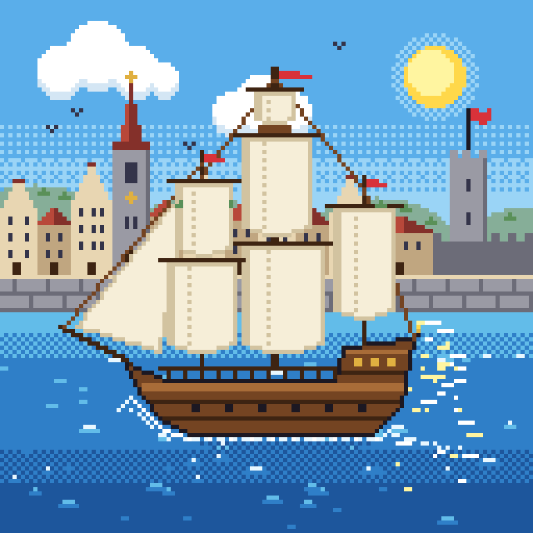

# pixet

MCP server that gives Claude Code a pixel art editor. All drawing uses indexed
colors from a palette. The agent can call `get_image` to see the result and
iterate.

The image lives in a PNG file on disk. Every tool reads the file first, and
every change writes it back at once, so you can watch the file in an image
viewer while the agent draws. The file is an indexed PNG, so it keeps the exact
color indices and the full palette (also colors not used yet).

## Install in Claude Code

This repo is a Claude Code plugin marketplace. You need
[uv](https://docs.astral.sh/uv/) on your `PATH`. In Claude Code, run:

```
/plugin marketplace add stur86/claude-pixet
/plugin install pixet@claude-pixet
```

Or from the shell:

```sh
claude plugin marketplace add stur86/claude-pixet
claude plugin install pixet@claude-pixet
```

The plugin starts the MCP server with `uv run`, so the first start installs
the Python dependencies.

To develop, load the plugin from your clone for one session:

```sh
claude --plugin-dir /path/to/claude-pixet
```

## Tools

| Tool | What it does |
|---|---|
| `new_image(path, width, height, background=0, record_frames=False)` | New blank image at `path` (max 1024x1024). Keeps the palette. With `record_frames`, every change also saves `name_0001.png`, `name_0002.png`, ... next to the file (old frames of that name are deleted first). |
| `set_palette(colors)` | Replace the palette with hex strings (`#RRGGBB`, `#RRGGBBAA`, ...). Max 256. |
| `get_palette()` | List `index=color` pairs. |
| `set_pixel(x, y, color)` | Set one pixel. |
| `set_pixels(points, color)` | Set many pixels in one call. |
| `draw_line(x0, y0, x1, y1, color)` | Bresenham line. |
| `draw_rect(x, y, width, height, color, filled=False)` | Rectangle outline or fill. |
| `draw_circle(cx, cy, radius, color, filled=False)` | Midpoint circle outline or fill. |
| `flood_fill(x, y, color, dither="none", color2=None, density=0.5)` | 4-connected fill. Dither: `none`, `checker`, `bayer` (uses `density`), `hlines`, `vlines`, `diagonal`. |
| `undo()` | Revert the last change (50 steps). Counts as a change, so it writes a frame. |
| `get_image(scale=None, grid=False)` | Scaled-up PNG preview for the agent. Transparency shows as a checkerboard. |
| `save_image(path, scale=1)` | Export a true-color copy with real transparency, for example scaled up. |

The default palette is PICO-8 with index 0 transparent and index 16 black.
Coordinates start at (0, 0) in the top-left. Shapes are clipped to the canvas.

## Examples

Save example images in `examples/` as `XX_<description>.png`
(for example `01_red_mushroom.png`). See `examples/README.md`.

Claude Code drew these examples with the pixet tools. For large shapes (hull,
sails, outlines, waves), a short Python script calculated the point lists
first, and then `set_pixels` drew them. Each example was made with
`new_image(..., record_frames=True)`, so every step is kept as a frame. The
GIFs replay these frames.

### Anime girl portrait (64x64)

A portrait of an anime-style girl with lavender hair, a red hair bow and a
sailor uniform. Order of work: back hair, neck and body, face shape, bangs
(an edge line across the face, then a flood fill above it), eyes with
highlights, blush and mouth, hair outline and shine, then uniform details.

| Final | Timelapse |
|---|---|
|  |  |

Files: [`examples/03_anime_girl_portrait/`](examples/03_anime_girl_portrait/)

### Sailing ship and 17th-century port (128x128)

A three-masted wooden ship on a blue sea on a sunny day, with a Dutch-style
port behind it: step-gabled houses, a church spire and a fort. Order of work:
sky gradient with Bayer dither, sun and clouds, houses, church and fort,
hills, sea bands, wave highlights and sun glitter, hull, masts and stays,
sails back to front, yards and pennants, and last the foam and wake.

| Final | Timelapse |
|---|---|
|  |  |

Files: [`examples/04_sailing_ship_port/`](examples/04_sailing_ship_port/)

## Develop

```sh
uv sync
uv run pytest
```
